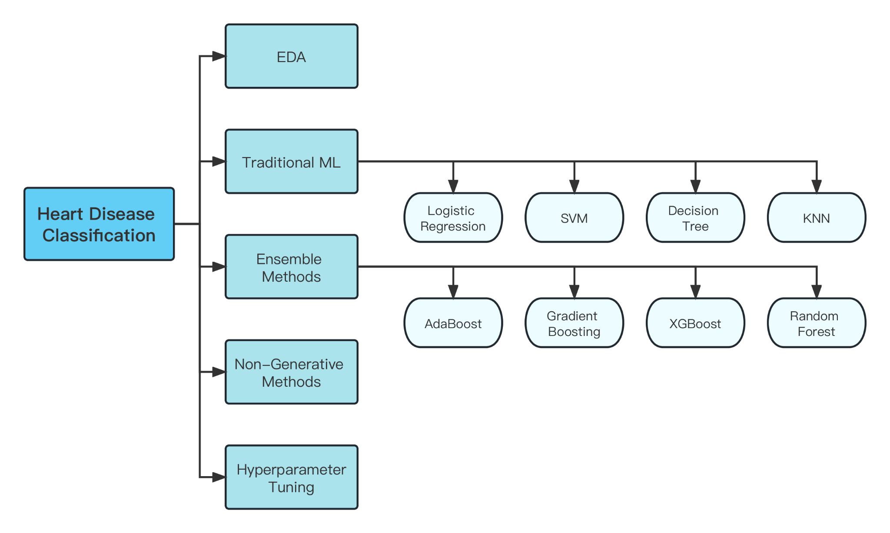
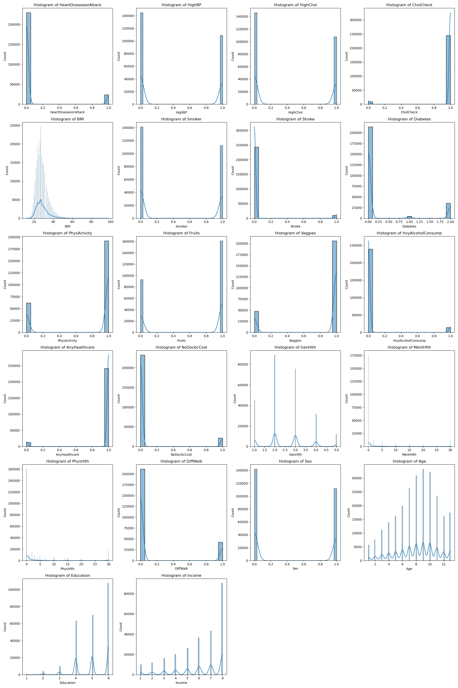
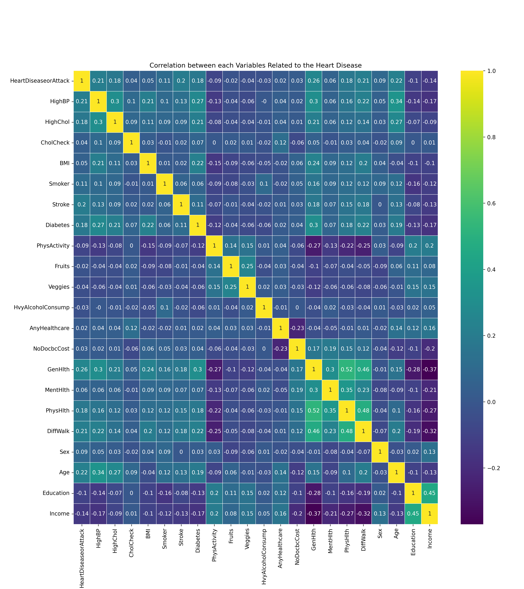
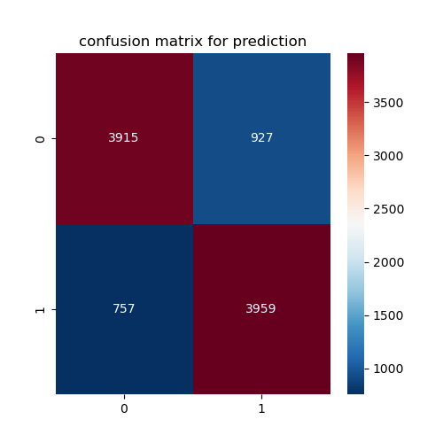

# DSAN6700-Project-Group06:
# Classification Based on Heart Disease Dataset

**Authors: Kefan Yu, Wendi Chu, Zifeng Xu**

## 1. Project Description

In this project, we are going to apply classification models on a heart disease dataset with target variable “HeartDiseaseorAttack”. This project aims to classify whether people have heart attacks or not. After evaluating individual models, we will stack them into one stacked model for deployment.

## 2. EDA

This dataset comprises 253680 data points encompassing 22 features, each representing a public's health condition, with the target variable being the presence of heart disease. 

## 3. Modeling

Since this study focuses on a classification problem, we are going to perform the analysis using different machine learning classifiers, including Logistic Regression, K-Nearest Neighbors (KNN) Classifier, Decision Tree, Gaussian Naive Bayes Classifier, Random Forest, Bagging Classifier, Gradient Boosting, and XGBoost Classifier as possible candidate classifiers.

Based on the model performance results, Logistic Regression, Random Forest Classifier, Gradient Boosting Classifier, and XGBoost Classifier have high accuracy scores above 0.9. Therefore, we choose Random Forest Classifier, Gradient Boosting Classifier and XGBoost Classifier as the candidate models for level 0 in the stacking classification, and use Logistic Regression as the level 1 model for this stacked classifier. 

Following additional hyperparameter tuning using GridSearchCV, along with implementing an undersampling strategy to address the data's imbalance, the final model achieves an accuracy of 0.82 and a recall of 0.84.

## 4. Feature Importance and PCA

We have looked at the feature importance or coefficients of Logistic Regression, Random Forest, GradientBoosting and XGBoost models.

It is worth mentioning that the top four features with the highest importance are consistent across both the Gradient Boosting and XGBoost models, which are 'General Health', 'Stroke', 'High Blood Pressure', 'Age', indicating a strong agreement between the two models regarding the most influential predictors in the dataset.

There are totally 21 independent variables in the dataset. We apply PCA on this data and choose the first two principal components for visualization. This is a scatter plot of a random sample with 10000 records from the whole dataset, where x-axis and y-axis respectively refer to the first and second principal component under PCA analysis. In the visualization, red dots depict patients who have experienced heart disease or a heart attack, whereas blue dots denote individuals without heart problems. According to the plot, although a distinct demarcation between the two groups is absent, there's a noticeable trend where blue points predominantly gather towards the lower left and middle left, while red points seem to amass more on the lower right side.

## 5. Application

[Risk Predictor: Assess Your Heart Attack/Disease Risk](https://appanlyg06-3f43980c4ca5.herokuapp.com/)

Above is the link of our web application for predicting the heart attack or disease risk, where you can type in a list of 21 values for the independent variables and get the prediction result.

Here are some data input sample for use:

High Risk:
[1.0,1.0,1.0,47.0,1.0,0.0,0.0,0.0,1.0,1.0,0.0,1.0,1.0,2.0,0.0,1.0,0.0,1.0,12.0,4.0,2.0]
[1.0,1.0,1.0,34.0,0.0,0.0,2.0,0.0,1.0,1.0,0.0,1.0,1.0,4.0,0.0,14.0,1.0,0.0,9.0,5.0,1.0]
[1.0,1.0,1.0,45.0,0.0,0.0,2.0,1.0,1.0,0.0,0.0,1.0,1.0,4.0,15.0,10.0,0.0,0.0,8.0,5.0,3.0]

Low Risk:
[0.0,0.0,1.0,22.0,0.0,0.0,0.0,1.0,0.0,0.0,0.0,1.0,0.0,1.0,0.0,3.0,0.0,1.0,2.0,4.0,1.0]
[1.0,0.0,1.0,28.0,1.0,0.0,0.0,0.0,1.0,1.0,0.0,1.0,0.0,2.0,0.0,1.0,0.0,1.0,5.0,5.0,8.0]
[1.0,0.0,1.0,28.0,1.0,0.0,0.0,0.0,1.0,1.0,0.0,1.0,0.0,2.0,0.0,1.0,0.0,1.0,5.0,5.0,8.0]

## 6. Code Description

You are welcomed to look through our code and dataset for this project within the 'code+data' folder.
- heart_disease_2015.csv: The dataset used in this project
- data_processing_and_modeling.ipynb: The main part of our code, including the data preprocessing, some EDA process, data modeling, hyperparameter tuning, and model export
- project_eda.ipynb: This notebook contains more EDA work
- Undersample_training.ipynb: We leverege undersampling strategy to address the data's imbalance and train the models again within this notebook 
- Feature_importance_and_PCA.ipynb: This notebook includes the process of feature importance check and PCA

## 7. Application Repository

The app-g06 folder is the application repo deployed on Heroku.

- app: Folder that has html template, css sheet, app.py, requirements.txt, and SampleProjectJoblib.joblib
- MLmodel.ipynb: The model notebook in which we export it into the joblib file
- Procfile: Configuration file
- requirements.txt: Necessary packages with required versions
- runtime.txt: Specifying specific Python runtime
- wsgi.py: Containing app.run()

**You can read the Project Report for more details about this whole machine learning project :)**
